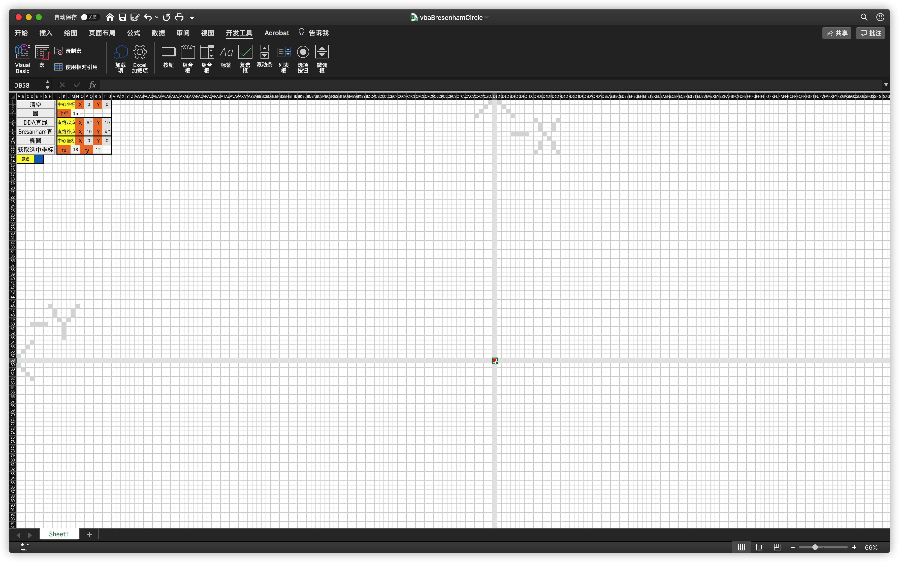
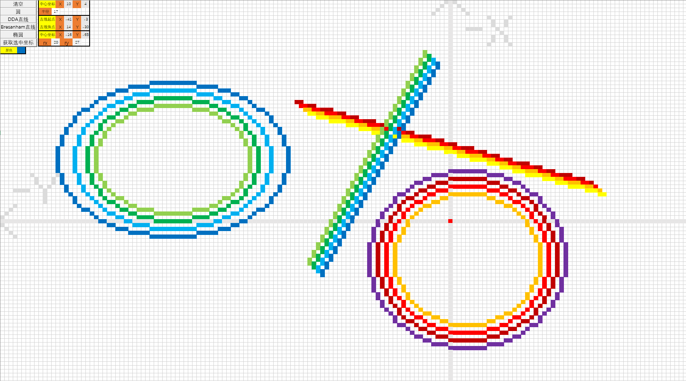

# VBA图形学基础内容

date: 2020.10.05

好久没有用过VBA了，蛮有意思的。

## 功能

- DDA直线
- Bresenham直线
- 圆
- 椭圆

## 使用方法

使用Microsoft Excel打开，遇到提示需要点击启用宏。



## 效果




## 算法

``` vbscript
Sub bresenhanCir()

Dim orgX As Integer
Dim orgY As Integer
Dim R As Integer
orgX = CInt(Cells(1, 16).Value)
orgY = CInt(Cells(1, 20).Value)
R = CInt(Cells(3, 13).Value)

Dim x As Integer, y As Integer, p As Integer
y = R
p = 3 - 2 * R

For x = 0 To y
If x > y Then
    Exit For
End If

    Call setPixel(x + orgX, y + orgY)
    Call setPixel(-x + orgX, y + orgY)
    Call setPixel(x + orgX, -y + orgY)
    Call setPixel(-x + orgX, -y + orgY)
    Call setPixel(y + orgX, x + orgY)
    Call setPixel(-y + orgX, x + orgY)
    Call setPixel(y + orgX, -x + orgY)
    Call setPixel(-y + orgX, -x + orgY)
    If p >= 0 Then
        p = p + 4 * (x - y) + 10
        y = y - 1
    Else
        p = p + 4 * x + 6
    End If
    Call delay(0.25)
Next

End Sub
```

```vbscript
Rem 椭圆
Sub ellipse()
Dim orgX As Integer
Dim orgY As Integer
Dim rX As Integer
Dim rY As Integer
Dim rX2 As Long
Dim rY2 As Long
Dim twoRX2 As Long
Dim twoRY2 As Long
Dim p As Long
Dim pX As Long
Dim pY As Long
Dim x As Integer
Dim y As Integer

orgX = CInt(Cells(9, 16).Value)
orgY = CInt(Cells(9, 20).Value)
rX = CInt(Cells(11, 13).Value)
rY = CInt(Cells(11, 18).Value)

rX2 = rX * rX
rY2 = rY * rY
twoRX2 = 2 * rX2
twoRY2 = 2 * rY2
x = 0
y = rY
pX = 0
pY = twoRX2 * y

Call ellipseSetpixel(orgX, orgY, x, y)

Rem 上半部分
p = CInt(rY2 - (rX2 * rY) + (0.25 * rX2))
While (pX < pY)
    Call delay(0.25)
    x = x + 1
    pX = pX + twoRY2
    If (p < 0) Then
        p = p + rY2 + pX
    Else
        y = y - 1
        pY = pY - twoRX2
        p = p + rY2 + pX - pY
    End If
    Call ellipseSetpixel(orgX, orgY, x, y)
Wend

Rem 下半部分
p = rY2 * (x + 0.5) * (x + 0.5) + rX2 * (y - 1) * (y - 1) - rX2 * rY2
While (y > 0)
    Call delay(0.25)
    y = y - 1
    pY = pY - twoRX2
    If (p > 0) Then
        p = p + rX2 - pY
    Else
        x = x + 1
        pX = pX + twoRY2
        p = p + rX2 - pY + pX
    End If
    Call ellipseSetpixel(orgX, orgY, x, y)
Wend
```

## 彩蛋

