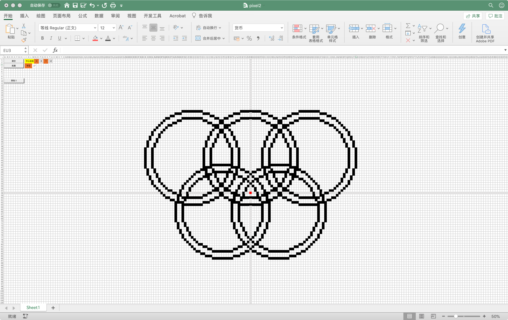

# bresenham画圆

date: 2020.10.05

好久没有用过VBA了，蛮有意思的。

## 算法

``` vb
Sub bresenhanCir()

Dim orgX As Integer
Dim orgY As Integer
Dim R As Integer
orgX = CInt(Cells(1, 16).Value)
orgY = CInt(Cells(1, 20).Value)
R = CInt(Cells(3, 13).Value)

Dim x As Integer, y As Integer, p As Integer
y = R
p = 3 - 2 * R

For x = 0 To y
If x > y Then
    Exit For
End If

    Call setPixel(x + orgX, y + orgY)
    Call setPixel(-x + orgX, y + orgY)
    Call setPixel(x + orgX, -y + orgY)
    Call setPixel(-x + orgX, -y + orgY)
    Call setPixel(y + orgX, x + orgY)
    Call setPixel(-y + orgX, x + orgY)
    Call setPixel(y + orgX, -x + orgY)
    Call setPixel(-y + orgX, -x + orgY)
    If p >= 0 Then
        p = p + 4 * (x - y) + 10
        y = y - 1
    Else
        p = p + 4 * x + 6
    End If
    Call delay(0.25)
Next

End Sub
```

## 使用方法

使用Microsoft Excel打开，遇到提示需要点击启用宏。



## 效果


